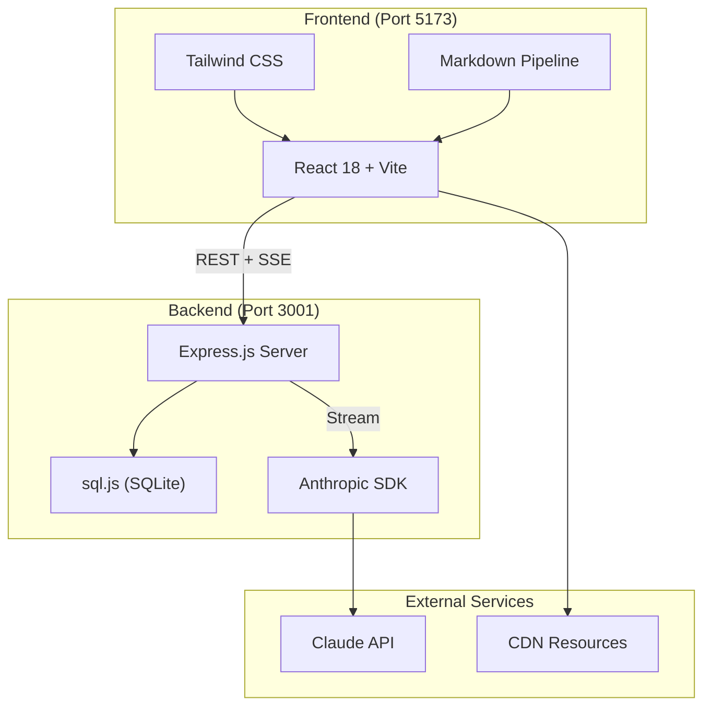
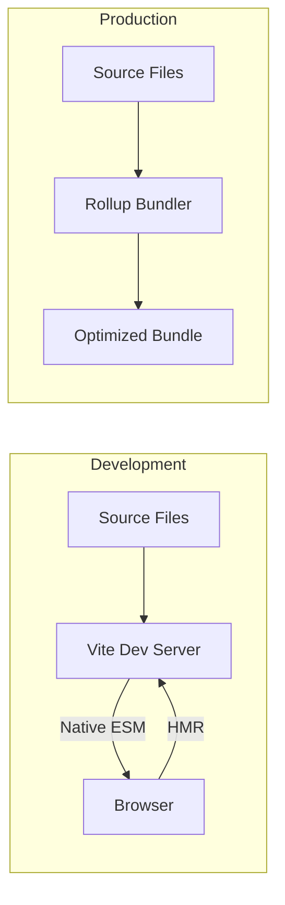
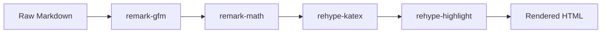
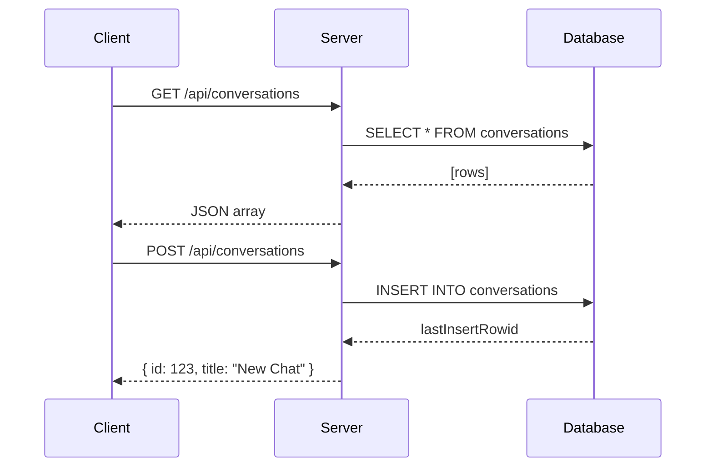
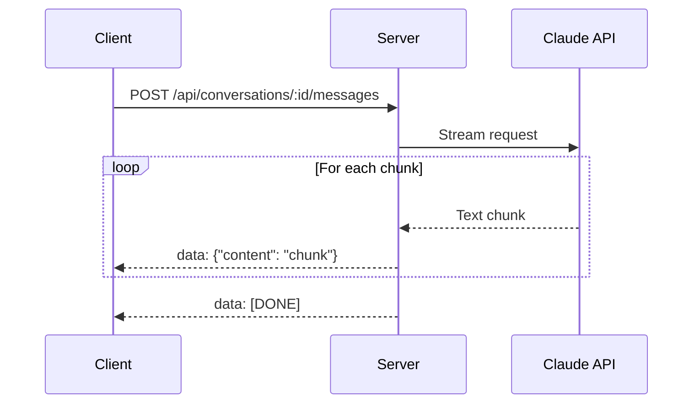
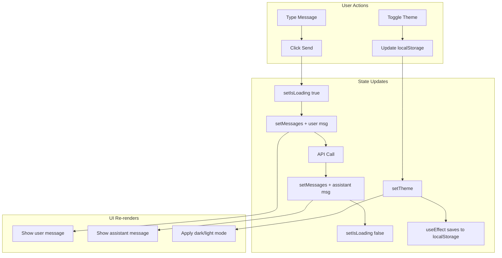

# Tech Stack Deep Dive: Claude AI Clone

A comprehensive analysis of the technologies, patterns, and architectural decisions used in this full-stack AI chat application.

---

## Table of Contents

1. [Architecture Overview](#architecture-overview)
2. [Frontend Stack](#frontend-stack)
   - [React 18](#react-18)
   - [Vite Build Tool](#vite-build-tool)
   - [Tailwind CSS](#tailwind-css)
   - [Markdown Rendering Pipeline](#markdown-rendering-pipeline)
3. [Backend Stack](#backend-stack)
   - [Express.js](#expressjs)
   - [sql.js (SQLite)](#sqljs-sqlite)
   - [Anthropic SDK](#anthropic-sdk)
4. [Communication Patterns](#communication-patterns)
   - [REST API](#rest-api)
   - [Server-Sent Events (SSE)](#server-sent-events-sse)
5. [State Management](#state-management)
6. [Progressive Web App (PWA)](#progressive-web-app-pwa)
7. [Accessibility Features](#accessibility-features)
8. [Key Patterns and Techniques](#key-patterns-and-techniques)

---

## Architecture Overview

This application follows a **client-server architecture** with real-time streaming capabilities for AI responses.



### Technology Summary Table

| Layer | Technology | Version | Purpose |
|-------|------------|---------|---------|
| **UI Framework** | React | 18.3.1 | Component-based UI |
| **Build Tool** | Vite | 6.0.1 | Fast development & bundling |
| **Styling** | Tailwind CSS | 3.4.15 | Utility-first CSS |
| **Routing** | React Router DOM | 6.28.0 | Client-side navigation |
| **Server** | Express.js | 4.21.2 | REST API & SSE |
| **Database** | sql.js | 1.10.3 | SQLite in WebAssembly |
| **AI Integration** | @anthropic-ai/sdk | 0.27.0 | Claude API client |
| **Markdown** | react-markdown | 9.0.1 | Markdown rendering |

---

## Frontend Stack

### React 18

React is the UI library used for building the interface. This project uses **functional components** with **React Hooks** exclusively.

#### Core Concepts Used

**1. useState Hook - Managing Component State**

The `useState` hook creates reactive variables that trigger re-renders when changed.

```jsx
// Example from App.jsx - Basic state for UI toggles
const [isDark, setIsDark] = useState(false)
const [isLoading, setIsLoading] = useState(false)
const [showArtifactPanel, setShowArtifactPanel] = useState(false)

// State with initializer function (runs once on mount)
const [theme, setTheme] = useState(() => {
  const saved = localStorage.getItem('theme')
  return saved || 'light'
})
```

**How it works:** `useState` returns an array with two elements: the current value and a setter function. When you call the setter, React schedules a re-render with the new value.

**2. useEffect Hook - Side Effects and Lifecycle**

`useEffect` handles operations that happen outside React's render cycle, like API calls, subscriptions, and DOM manipulation.

```jsx
// Example 1: Run once on component mount (empty dependency array)
useEffect(() => {
  loadUser()
  loadConversations()
  loadProjects()
  loadFolders()
  loadCustomInstructions()
}, [])

// Example 2: Run when specific value changes
useEffect(() => {
  localStorage.setItem('theme', theme)
}, [theme])

// Example 3: Cleanup function for subscriptions
useEffect(() => {
  const handleOnline = () => setIsOnline(true)
  const handleOffline = () => setIsOnline(false)

  window.addEventListener('online', handleOnline)
  window.addEventListener('offline', handleOffline)

  // Cleanup: remove listeners when component unmounts
  return () => {
    window.removeEventListener('online', handleOnline)
    window.removeEventListener('offline', handleOffline)
  }
}, [])

// Example 4: Auto-dismiss notifications
useEffect(() => {
  if (successMessage) {
    const timer = setTimeout(() => {
      setSuccessMessage(null)
    }, 3000)
    return () => clearTimeout(timer)
  }
}, [successMessage])
```

**3. useRef Hook - Persistent References**

`useRef` creates a mutable reference that persists across renders without causing re-renders.

```jsx
// References to DOM elements
const messagesEndRef = useRef(null)
const chatContainerRef = useRef(null)
const textareaRef = useRef(null)
const fileInputRef = useRef(null)

// References for async operations (not triggering re-renders)
const streamReaderRef = useRef(null)
const abortControllerRef = useRef(null)

// Usage: Scroll to bottom of chat
useEffect(() => {
  if (chatContainerRef.current) {
    chatContainerRef.current.scrollTop = chatContainerRef.current.scrollHeight
  }
}, [messages])
```

**4. Component Composition Pattern**

Smaller components are composed together to build complex UIs:

```jsx
// Tooltip component with children pattern
function Tooltip({ children, text, position = 'top' }) {
  const [isVisible, setIsVisible] = useState(false)
  const timeoutRef = useRef(null)

  const showTooltip = () => {
    timeoutRef.current = setTimeout(() => setIsVisible(true), 500)
  }

  const hideTooltip = () => {
    if (timeoutRef.current) clearTimeout(timeoutRef.current)
    setIsVisible(false)
  }

  return (
    <div
      className="relative inline-block"
      onMouseEnter={showTooltip}
      onMouseLeave={hideTooltip}
    >
      {children}
      {isVisible && text && (
        <div className={`absolute ${positionClasses[position]} z-50`}>
          <div className="bg-gray-900 text-white text-xs px-3 py-1.5 rounded-lg">
            {text}
          </div>
        </div>
      )}
    </div>
  )
}

// Usage
<Tooltip text="Click to copy" position="top">
  <button onClick={handleCopy}>Copy</button>
</Tooltip>
```

---

### Vite Build Tool

Vite is a modern build tool that provides fast development server and optimized production builds.

#### Configuration

```javascript
// vite.config.js
import { defineConfig } from 'vite'
import react from '@vitejs/plugin-react'

export default defineConfig({
  plugins: [react()],  // Enable React Fast Refresh
  server: {
    port: 5173,        // Development server port
    host: true         // Allow network access (for mobile testing)
  }
})
```

#### Package Scripts

```json
{
  "scripts": {
    "dev": "vite --port 5173",    // Start dev server with hot reload
    "build": "vite build",         // Production build
    "preview": "vite preview",     // Preview production build locally
    "lint": "eslint . --ext js,jsx"
  }
}
```

#### How Vite Works



**Key Benefits:**
- **Instant server start** - No bundling needed for development
- **Hot Module Replacement (HMR)** - Changes reflect instantly
- **Native ES Modules** - Browser loads modules directly
- **Optimized builds** - Uses Rollup for production

---

### Tailwind CSS

Tailwind CSS is a utility-first CSS framework that enables rapid UI development through composable classes.

#### Configuration (via CDN)

```html
<!-- index.html -->
<script src="https://cdn.tailwindcss.com"></script>
<script>
  tailwind.config = {
    darkMode: 'class',  // Enable dark mode via class toggle
    theme: {
      extend: {
        colors: {
          'claude-orange': '#CC785C',       // Custom brand color
          'claude-orange-hover': '#B56A50',
        }
      }
    }
  }
</script>
```

#### Core Utility Examples

**1. Layout and Spacing**

```jsx
// Flexbox layout with gap
<div className="flex items-center gap-2">
  <span>Icon</span>
  <span>Label</span>
</div>

// Grid layout
<div className="grid grid-cols-3 gap-4">
  <div>Item 1</div>
  <div>Item 2</div>
  <div>Item 3</div>
</div>

// Padding and margin
<div className="px-4 py-3 mb-4">  {/* padding-x: 1rem, padding-y: 0.75rem, margin-bottom: 1rem */}
  Content
</div>
```

**2. Responsive Design**

Tailwind uses mobile-first breakpoints. Classes without prefix apply to all sizes, prefixed classes apply at that breakpoint and up.

```jsx
// Sidebar that collapses on mobile
<aside className={`
  ${isSidebarCollapsed ? 'w-0' : 'w-64'}  // Default width
  sm:w-64                                  // Always 64 on small screens and up
  md:w-72                                  // 72 on medium screens and up
  transition-all duration-300
`}>
```

| Breakpoint | Min Width | Example Usage |
|------------|-----------|---------------|
| `sm:` | 640px | `sm:flex` |
| `md:` | 768px | `md:grid-cols-2` |
| `lg:` | 1024px | `lg:w-96` |
| `xl:` | 1280px | `xl:max-w-6xl` |

**3. Dark Mode**

```jsx
// Classes with dark: prefix apply in dark mode
<div className="bg-white dark:bg-[#1A1A1A] text-gray-900 dark:text-gray-100">
  <button className="bg-gray-100 dark:bg-gray-800 hover:bg-gray-200 dark:hover:bg-gray-700">
    Click me
  </button>
</div>

// Toggle dark mode
const [isDark, setIsDark] = useState(false)

useEffect(() => {
  if (isDark) {
    document.documentElement.classList.add('dark')
  } else {
    document.documentElement.classList.remove('dark')
  }
}, [isDark])
```

**4. Interactive States**

```jsx
<button className="
  bg-claude-orange           // Default state
  hover:bg-claude-orange-hover  // Mouse hover
  focus:ring-2               // Keyboard focus
  focus:ring-offset-2
  active:scale-95            // Click/press
  disabled:opacity-50        // Disabled state
  disabled:cursor-not-allowed
  transition-all duration-200  // Smooth transitions
">
  Submit
</button>

// Group hover - parent hover affects children
<div className="group">
  <button className="opacity-0 group-hover:opacity-100">
    Hidden until parent is hovered
  </button>
</div>
```

---

### Markdown Rendering Pipeline

The application uses a sophisticated pipeline to render markdown with support for code highlighting, math equations, and diagrams.



#### Pipeline Configuration

```jsx
import ReactMarkdown from 'react-markdown'
import remarkGfm from 'remark-gfm'
import remarkMath from 'remark-math'
import rehypeKatex from 'rehype-katex'
import rehypeHighlight from 'rehype-highlight'

// Usage in component
<ReactMarkdown
  remarkPlugins={[remarkGfm, remarkMath]}      // Parse GFM and math
  rehypePlugins={[rehypeKatex, rehypeHighlight]}  // Render math and code
  components={{
    code: CodeBlock  // Custom code block component
  }}
>
  {message.content}
</ReactMarkdown>
```

| Plugin | Purpose | Example Input | Output |
|--------|---------|--------------|--------|
| `remark-gfm` | GitHub Flavored Markdown | `~~strikethrough~~` | <del>strikethrough</del> |
| `remark-math` | Math notation parsing | `$x^2$` | Parsed math AST |
| `rehype-katex` | Math rendering | Math AST | Rendered equations |
| `rehype-highlight` | Code syntax highlighting | \`\`\`js | Colored code |

#### Custom Code Block Component

```jsx
function CodeBlock({ node, inline, className, children, ...props }) {
  const [copied, setCopied] = useState(false)
  const codeRef = useRef(null)

  const handleCopy = async () => {
    const code = codeRef.current?.textContent || ''
    try {
      await navigator.clipboard.writeText(code)
      setCopied(true)
      setTimeout(() => setCopied(false), 2000)
    } catch (err) {
      console.error('Failed to copy:', err)
    }
  }

  if (inline) {
    return <code className={className} {...props}>{children}</code>
  }

  return (
    <div className="relative group">
      <button
        onClick={handleCopy}
        className="absolute right-2 top-2 px-2 py-1 text-xs
          bg-gray-700 hover:bg-gray-600 text-white rounded
          opacity-0 group-hover:opacity-100 transition-all"
      >
        {copied ? 'Copied!' : 'Copy'}
      </button>
      <pre>
        <code ref={codeRef} className={className}>
          {children}
        </code>
      </pre>
    </div>
  )
}
```

---

## Backend Stack

### Express.js

Express is a minimal Node.js web framework for building APIs and web applications.

#### Server Setup

```javascript
// server/server.js
import express from 'express';
import cors from 'cors';
import dotenv from 'dotenv';

// Load environment variables from .env file
dotenv.config({ path: join(dirname(fileURLToPath(import.meta.url)), '..', '.env') });

const app = express();
const PORT = process.env.PORT || 3001;

// Middleware stack
app.use(cors());                              // Enable Cross-Origin requests
app.use(express.json({ limit: '10mb' }));     // Parse JSON bodies
app.use(express.urlencoded({ extended: true }));  // Parse URL-encoded bodies

// Request logging middleware
app.use((req, res, next) => {
  console.log(`[${new Date().toISOString()}] ${req.method} ${req.path}`);
  next();  // Pass to next middleware
});
```

#### Route Patterns

**1. Basic CRUD Operations**

```javascript
// GET - Retrieve all conversations
app.get('/api/conversations', (req, res) => {
  const conversations = dbHelpers.prepare(`
    SELECT * FROM conversations
    WHERE is_deleted = 0
    ORDER BY last_message_at DESC
  `).all();
  res.json(conversations);
});

// GET - Retrieve single conversation by ID
app.get('/api/conversations/:id', (req, res) => {
  const { id } = req.params;  // Extract URL parameter
  const conversation = dbHelpers.prepare(
    'SELECT * FROM conversations WHERE id = ?'
  ).get(id);

  if (!conversation) {
    return res.status(404).json({ error: 'Conversation not found' });
  }
  res.json(conversation);
});

// POST - Create new conversation
app.post('/api/conversations', (req, res) => {
  const { title } = req.body;
  const result = dbHelpers.prepare(
    'INSERT INTO conversations (title) VALUES (?)'
  ).run(title || 'New Conversation');

  res.status(201).json({
    id: result.lastInsertRowid,
    title: title || 'New Conversation'
  });
});

// PUT - Update conversation
app.put('/api/conversations/:id', (req, res) => {
  const { id } = req.params;
  const { title, is_archived, is_pinned } = req.body;

  dbHelpers.prepare(`
    UPDATE conversations
    SET title = ?, is_archived = ?, is_pinned = ?, updated_at = CURRENT_TIMESTAMP
    WHERE id = ?
  `).run(title, is_archived ? 1 : 0, is_pinned ? 1 : 0, id);

  res.json({ success: true });
});

// DELETE - Remove conversation (soft delete)
app.delete('/api/conversations/:id', (req, res) => {
  const { id } = req.params;
  dbHelpers.prepare(
    'UPDATE conversations SET is_deleted = 1 WHERE id = ?'
  ).run(id);

  res.json({ success: true });
});
```

**2. Nested Resources**

```javascript
// Messages belong to conversations
app.get('/api/conversations/:conversationId/messages', (req, res) => {
  const { conversationId } = req.params;
  const messages = dbHelpers.prepare(`
    SELECT * FROM messages
    WHERE conversation_id = ?
    ORDER BY created_at ASC
  `).all(conversationId);

  res.json(messages);
});

// Artifacts belong to conversations
app.get('/api/conversations/:conversationId/artifacts', (req, res) => {
  const { conversationId } = req.params;
  const artifacts = dbHelpers.prepare(`
    SELECT * FROM artifacts
    WHERE conversation_id = ?
    ORDER BY created_at DESC
  `).all(conversationId);

  res.json(artifacts);
});
```

---

### sql.js (SQLite)

sql.js is SQLite compiled to WebAssembly, allowing SQLite to run entirely in JavaScript without native dependencies.

#### Database Initialization

```javascript
import initSqlJs from 'sql.js';
import { readFileSync, writeFileSync, existsSync, mkdirSync } from 'fs';

const dbPath = join(dirname(fileURLToPath(import.meta.url)), 'data', 'claude.db');

// Ensure data directory exists
if (!existsSync(dataDir)) {
  mkdirSync(dataDir, { recursive: true });
}

// Initialize sql.js and load/create database
const SQL = await initSqlJs();

let db;
if (existsSync(dbPath)) {
  // Load existing database from file
  const buffer = readFileSync(dbPath);
  db = new SQL.Database(buffer);
} else {
  // Create new empty database
  db = new SQL.Database();
}

// Helper to persist changes to disk
function saveDatabase() {
  const data = db.export();
  const buffer = Buffer.from(data);
  writeFileSync(dbPath, buffer);
}
```

#### Database Helper Layer

sql.js has a different API than typical SQLite libraries. This helper layer provides a familiar interface:

```javascript
const dbHelpers = {
  prepare: (sql) => ({
    // Execute SQL that modifies data (INSERT, UPDATE, DELETE)
    run: (...params) => {
      let boundSql = sql;

      // Replace ? placeholders with escaped values
      const tokens = params.map((_, i) => `__PARAM_${i}__`);
      tokens.forEach((token, index) => {
        boundSql = boundSql.replace('?', token);
      });

      params.forEach((param, index) => {
        const value = param === null || param === undefined
          ? 'NULL'
          : `'${String(param).replace(/'/g, "''")}'`;  // Escape quotes
        boundSql = boundSql.replace(`__PARAM_${index}__`, value);
      });

      db.exec(boundSql);
      saveDatabase();  // Persist to disk

      // Get last inserted ID
      const tableMatch = sql.match(/INSERT INTO (\w+)/i);
      const tableName = tableMatch ? tableMatch[1] : null;
      let rowid = null;
      if (tableName) {
        const maxIdResult = db.exec(`SELECT MAX(id) FROM ${tableName}`);
        rowid = maxIdResult[0]?.values[0]?.[0];
      }

      return { lastInsertRowid: rowid };
    },

    // Get single row
    get: (...params) => {
      const result = db.exec(sql, params);
      if (result.length === 0) return null;

      const row = result[0];
      const obj = {};
      row.columns.forEach((col, i) => {
        obj[col] = row.values[0]?.[i];
      });
      return obj;
    },

    // Get all rows
    all: (...params) => {
      const result = db.exec(sql, params);
      if (result.length === 0) return [];

      const row = result[0];
      return row.values.map(values => {
        const obj = {};
        row.columns.forEach((col, i) => {
          obj[col] = values[i];
        });
        return obj;
      });
    }
  })
};
```

#### Database Schema

```sql
-- Core tables
CREATE TABLE IF NOT EXISTS conversations (
    id INTEGER PRIMARY KEY AUTOINCREMENT,
    user_id INTEGER,
    project_id INTEGER,
    title TEXT DEFAULT 'New Conversation',
    model TEXT DEFAULT 'claude-sonnet-4-20250514',
    created_at DATETIME DEFAULT CURRENT_TIMESTAMP,
    updated_at DATETIME DEFAULT CURRENT_TIMESTAMP,
    last_message_at DATETIME,
    is_archived BOOLEAN DEFAULT 0,
    is_pinned BOOLEAN DEFAULT 0,
    is_deleted BOOLEAN DEFAULT 0,
    token_count INTEGER DEFAULT 0,
    message_count INTEGER DEFAULT 0,
    FOREIGN KEY (user_id) REFERENCES users(id),
    FOREIGN KEY (project_id) REFERENCES projects(id)
);

CREATE TABLE IF NOT EXISTS messages (
    id INTEGER PRIMARY KEY AUTOINCREMENT,
    conversation_id INTEGER NOT NULL,
    role TEXT NOT NULL,           -- 'user' or 'assistant'
    content TEXT NOT NULL,
    created_at DATETIME DEFAULT CURRENT_TIMESTAMP,
    tokens INTEGER,
    images TEXT,                  -- JSON array of base64 images
    parent_message_id INTEGER,    -- For conversation branching
    FOREIGN KEY (conversation_id) REFERENCES conversations(id)
);

CREATE TABLE IF NOT EXISTS artifacts (
    id INTEGER PRIMARY KEY AUTOINCREMENT,
    message_id INTEGER NOT NULL,
    conversation_id INTEGER NOT NULL,
    type TEXT NOT NULL,           -- 'html', 'svg', 'react', 'mermaid', 'code'
    title TEXT,
    language TEXT,
    content TEXT NOT NULL,
    version INTEGER DEFAULT 1,
    created_at DATETIME DEFAULT CURRENT_TIMESTAMP,
    FOREIGN KEY (message_id) REFERENCES messages(id)
);
```

---

### Anthropic SDK

The Anthropic SDK provides the interface to Claude's AI capabilities.

#### Client Setup

```javascript
import Anthropic from '@anthropic-ai/sdk';

// Initialize client with API key from environment
const anthropic = new Anthropic({
  apiKey: process.env.ANTHROPIC_API_KEY
});
```

#### Streaming Message Request

```javascript
// Build API parameters
const apiParams = {
  model: model || 'claude-sonnet-4-20250514',
  max_tokens: maxTokens || 4096,
  system: systemPrompt || '',
  messages: formattedMessages.map(msg => ({
    role: msg.role,
    content: msg.images?.length > 0
      ? [
          ...msg.images.map(img => ({
            type: 'image',
            source: {
              type: 'base64',
              media_type: img.type,
              data: img.data
            }
          })),
          { type: 'text', text: msg.content }
        ]
      : msg.content
  }))
};

// Create streaming request
const stream = await anthropic.messages.stream(apiParams);

let fullResponse = '';

// Process stream chunks
for await (const chunk of stream) {
  if (chunk.type === 'content_block_delta' && chunk.delta.type === 'text_delta') {
    const text = chunk.delta.text;
    fullResponse += text;

    // Send to client via SSE
    res.write(`data: ${JSON.stringify({ content: text })}\n\n`);
  }
}

// Signal completion
res.write('data: [DONE]\n\n');
res.end();
```

---

## Communication Patterns

### REST API

REST (Representational State Transfer) is used for all CRUD operations.



#### Fetch API Usage (Frontend)

```javascript
// GET request
const loadConversations = async () => {
  try {
    const response = await fetch(`${API_BASE}/conversations`);

    if (!response.ok) {
      console.error('Failed:', response.status, response.statusText);
      return;
    }

    const data = await response.json();
    setConversations(Array.isArray(data) ? data : []);
  } catch (error) {
    console.error('Error loading conversations:', error);
  }
};

// POST request with JSON body
const createConversation = async (title) => {
  const response = await fetch(`${API_BASE}/conversations`, {
    method: 'POST',
    headers: { 'Content-Type': 'application/json' },
    body: JSON.stringify({ title })
  });
  return await response.json();
};

// DELETE request
const deleteConversation = async (id) => {
  await fetch(`${API_BASE}/conversations/${id}`, {
    method: 'DELETE'
  });
};
```

---

### Server-Sent Events (SSE)

SSE enables the server to push data to the client in real-time, perfect for streaming AI responses.



#### Server-Side SSE (Express)

```javascript
// Set up SSE headers
res.setHeader('Content-Type', 'text/event-stream');
res.setHeader('Cache-Control', 'no-cache');
res.setHeader('Connection', 'keep-alive');

// Stream data to client
for await (const chunk of stream) {
  if (chunk.type === 'content_block_delta') {
    const text = chunk.delta.text;

    // SSE format: "data: <content>\n\n"
    res.write(`data: ${JSON.stringify({ content: text })}\n\n`);
  }
}

// Signal completion
res.write('data: [DONE]\n\n');
res.end();
```

#### Client-Side SSE Handling (React)

```javascript
// Check if response is SSE
if (response.headers.get('content-type')?.includes('text/event-stream')) {
  setIsStreaming(true);

  const reader = response.body.getReader();
  const decoder = new TextDecoder();

  let assistantMessage = {
    id: Date.now(),
    role: 'assistant',
    content: '',
    created_at: new Date().toISOString()
  };

  // Add empty message to UI
  setMessages(prev => [...prev, assistantMessage]);

  // Process stream
  while (true) {
    const { value, done } = await reader.read();
    if (done) break;

    const chunk = decoder.decode(value);
    const lines = chunk.split('\n');

    for (const line of lines) {
      if (line.startsWith('data: ')) {
        const data = line.slice(6);  // Remove "data: " prefix

        if (data === '[DONE]') break;

        try {
          const parsed = JSON.parse(data);
          if (parsed.content) {
            // Append to message content
            assistantMessage.content += parsed.content;

            // Update UI with new content
            setMessages(prev => {
              const newMessages = [...prev];
              newMessages[newMessages.length - 1] = { ...assistantMessage };
              return newMessages;
            });
          }
        } catch (e) {
          // Ignore parse errors
        }
      }
    }
  }

  setIsStreaming(false);
}
```

---

## State Management

This application uses **React's built-in state management** (useState) rather than external libraries like Redux or Zustand.

### State Organization

| Category | State Variables | Purpose |
|----------|-----------------|---------|
| **UI State** | `isDark`, `isSidebarCollapsed`, `showModal*` | Visual presentation |
| **Data State** | `conversations`, `messages`, `artifacts` | Server data |
| **Loading State** | `isLoading`, `isStreaming`, `isLoadingMessages` | Async operation status |
| **Form State** | `inputValue`, `searchQuery`, `newProjectName` | User input |
| **Settings** | `theme`, `fontSize`, `reducedMotion` | User preferences |

### Local Storage Persistence

Settings are persisted to localStorage and loaded on mount:

```javascript
// Initialize state from localStorage
const [theme, setTheme] = useState(() => {
  const saved = localStorage.getItem('theme');
  return saved || 'light';
});

const [fontSize, setFontSize] = useState(() => {
  const saved = localStorage.getItem('fontSize');
  return saved ? Number(saved) : 16;
});

// Persist changes to localStorage
useEffect(() => {
  localStorage.setItem('theme', theme);
}, [theme]);

useEffect(() => {
  localStorage.setItem('fontSize', fontSize.toString());
}, [fontSize]);
```

### State Flow Diagram



---

## Progressive Web App (PWA)

The application can be installed on devices and work offline.

### Manifest Configuration

```json
{
  "name": "Claude AI Clone",
  "short_name": "Claude",
  "description": "AI-powered chat application",
  "start_url": "/",
  "display": "standalone",
  "background_color": "#1A1A1A",
  "theme_color": "#CC785C",
  "icons": [
    {
      "src": "/icon-192.svg",
      "sizes": "192x192",
      "type": "image/svg+xml"
    },
    {
      "src": "/icon-512.svg",
      "sizes": "512x512",
      "type": "image/svg+xml"
    }
  ]
}
```

### Service Worker

```javascript
// service-worker.js
const CACHE_NAME = 'claude-clone-v2';
const urlsToCache = ['/', '/index.html', '/manifest.json', '/icon.svg'];

// Install: Cache essential files
self.addEventListener('install', (event) => {
  event.waitUntil(
    caches.open(CACHE_NAME)
      .then((cache) => cache.addAll(urlsToCache))
      .then(() => self.skipWaiting())
  );
});

// Fetch: Serve from cache when offline
self.addEventListener('fetch', (event) => {
  const { request } = event;

  // API requests: network-first strategy
  if (request.url.includes('/api/')) {
    event.respondWith(
      fetch(request)
        .then((response) => {
          // Cache successful responses
          if (response.ok) {
            const responseToCache = response.clone();
            caches.open(CACHE_NAME).then(cache => cache.put(request, responseToCache));
          }
          return response;
        })
        .catch(() => {
          // Serve cached response when offline
          return caches.match(request).then(cached => {
            if (cached) return cached;

            // Return offline indicator
            return new Response(
              JSON.stringify({ offline: true, error: 'No network' }),
              { status: 503, headers: { 'Content-Type': 'application/json' } }
            );
          });
        })
    );
  } else {
    // Static assets: cache-first strategy
    event.respondWith(
      caches.match(request).then(cached => cached || fetch(request))
    );
  }
});
```

### Registration

```html
<script>
  if ('serviceWorker' in navigator) {
    window.addEventListener('load', () => {
      navigator.serviceWorker.register('/service-worker.js')
        .then((registration) => {
          console.log('SW registered:', registration.scope);
        })
        .catch((error) => {
          console.log('SW registration failed:', error);
        });
    });
  }
</script>
```

---

## Accessibility Features

The application implements comprehensive accessibility support.

### Focus Indicators

```css
/* Custom focus ring for all interactive elements */
button:focus-visible,
a:focus-visible,
input:focus-visible,
textarea:focus-visible {
  outline: none;
  box-shadow: 0 0 0 2px #ffffff, 0 0 0 4px #CC785C;
}

/* High contrast mode: stronger focus */
.high-contrast button:focus-visible {
  box-shadow: 0 0 0 3px #CC785C !important;
  outline: 3px solid #CC785C !important;
  outline-offset: 2px !important;
}
```

### Reduced Motion Support

```css
/* Disable animations for users who prefer reduced motion */
.reduce-motion *,
.reduce-motion *::before,
.reduce-motion *::after {
  animation-duration: 0.01ms !important;
  animation-iteration-count: 1 !important;
  transition-duration: 0.01ms !important;
  scroll-behavior: auto !important;
}

/* Also respect system preference */
@media (prefers-reduced-motion: reduce) {
  * {
    animation-duration: 0.01ms !important;
    transition-duration: 0.01ms !important;
  }
}
```

### ARIA Labels

```jsx
// Loading states
<div role="status" aria-live="polite" aria-label="Claude is thinking">
  <span className="text-sm">Claude is thinking</span>
  <div aria-hidden="true">
    {/* Animated dots - hidden from screen readers */}
  </div>
</div>

// Interactive elements
<button
  onClick={handleSubmit}
  aria-label="Send message"
  disabled={isLoading}
>
  <SendIcon aria-hidden="true" />
</button>

// Skip links for keyboard navigation
<a href="#main-content" className="sr-only focus:not-sr-only">
  Skip to main content
</a>
```

---

## Key Patterns and Techniques

### 1. Date Grouping

Conversations are grouped by relative time:

```javascript
function groupConversationsByDate(conversations) {
  const today = new Date();
  today.setHours(0, 0, 0, 0);

  const yesterday = new Date(today);
  yesterday.setDate(yesterday.getDate() - 1);

  const sevenDaysAgo = new Date(today);
  sevenDaysAgo.setDate(sevenDaysAgo.getDate() - 7);

  const groups = {
    today: [],
    yesterday: [],
    previous7Days: [],
    previous30Days: [],
    older: []
  };

  conversations.forEach(conv => {
    const convDate = new Date(conv.last_message_at || conv.created_at);
    convDate.setHours(0, 0, 0, 0);

    if (convDate.getTime() === today.getTime()) {
      groups.today.push(conv);
    } else if (convDate.getTime() === yesterday.getTime()) {
      groups.yesterday.push(conv);
    } else if (convDate >= sevenDaysAgo) {
      groups.previous7Days.push(conv);
    } else {
      groups.older.push(conv);
    }
  });

  return groups;
}
```

### 2. Debounced Search

```javascript
// Search with delay to avoid excessive API calls
useEffect(() => {
  const debounceTimeout = setTimeout(() => {
    if (searchQuery) {
      loadConversations(searchQuery);
    } else {
      loadConversations();
    }
  }, 300);  // Wait 300ms after typing stops

  return () => clearTimeout(debounceTimeout);
}, [searchQuery]);
```

### 3. Abort Controller for Request Cancellation

```javascript
const abortControllerRef = useRef(null);

const sendMessage = async (content) => {
  // Cancel any pending request
  if (abortControllerRef.current) {
    abortControllerRef.current.abort();
  }

  // Create new abort controller
  abortControllerRef.current = new AbortController();

  try {
    const response = await fetch(url, {
      method: 'POST',
      body: JSON.stringify({ content }),
      signal: abortControllerRef.current.signal  // Attach signal
    });
    // Handle response...
  } catch (error) {
    if (error.name === 'AbortError') {
      console.log('Request was cancelled');
      return;
    }
    throw error;
  }
};

// Stop streaming button
const stopStreaming = () => {
  if (abortControllerRef.current) {
    abortControllerRef.current.abort();
  }
};
```

### 4. Clipboard API

```javascript
const handleCopy = async () => {
  try {
    await navigator.clipboard.writeText(content);
    setCopied(true);
    setTimeout(() => setCopied(false), 2000);
  } catch (err) {
    console.error('Failed to copy:', err);
  }
};
```

---

## Summary

This application demonstrates a modern full-stack JavaScript architecture:

| Aspect | Implementation |
|--------|----------------|
| **Frontend** | React 18 with hooks, Vite, Tailwind CSS |
| **Backend** | Express.js REST API with SSE streaming |
| **Database** | sql.js (SQLite in WebAssembly) |
| **AI Integration** | Anthropic SDK with streaming |
| **State** | React useState/useEffect (no external library) |
| **Offline** | PWA with Service Worker |
| **Accessibility** | WCAG-compliant focus, motion, contrast |

The architecture prioritizes simplicity and developer experience while maintaining production-quality features like real-time streaming, offline support, and comprehensive accessibility.
