# Project Files Reference

A complete reference of every file in this Claude AI clone project, explaining what each file does and how they work together.

> **Note:** For deeper architectural details, database schema diagrams, and API endpoint documentation, see [architecture.md](./architecture.md).

---

## Quick Navigation

| Section | Description |
|---------|-------------|
| [Project Structure Overview](#project-structure-overview) | Visual map of the entire project |
| [Root Configuration Files](#root-configuration-files) | Build tools, package managers, environment |
| [Frontend Files](#frontend-files-src) | React application code |
| [Backend Files](#backend-files-server) | Express server and API |
| [Public Assets](#public-assets-public) | PWA, icons, service worker |
| [Documentation](#documentation-docs) | Project documentation |
| [File Relationships](#file-relationships) | How files connect and communicate |
| [Common Tasks Guide](#common-tasks-guide) | Where to look for specific changes |

---

## Project Structure Overview

```
claude_ai_clone/
├── src/                    # Frontend React application
│   ├── main.jsx           # App bootstrap
│   ├── App.jsx            # Main application (9,600+ lines)
│   ├── ErrorBoundary.jsx  # Error handling
│   └── index.css          # Global styles
│
├── server/                 # Backend Express server
│   ├── server.js          # API server (3,470+ lines)
│   ├── data/              # Database storage
│   │   └── claude.db      # SQLite database
│   └── package.json       # Server dependencies
│
├── public/                 # Static assets
│   ├── manifest.json      # PWA configuration
│   ├── service-worker.js  # Offline support
│   └── icon-*.svg         # App icons
│
├── docs/                   # Documentation
│   ├── architecture.md    # System architecture
│   └── project-files-reference.md  # This file
│
└── [config files]          # Root configuration
```

### Visual Project Map

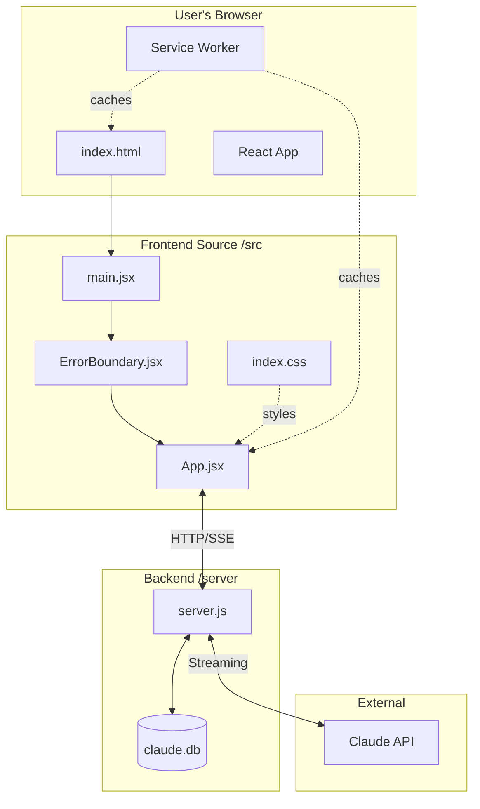

---

## Root Configuration Files

These files configure build tools, dependencies, and development environment.

### Package & Dependency Management

| File | Purpose | When to Modify |
|------|---------|----------------|
| `package.json` | Frontend npm configuration, scripts, dependencies | Adding frontend libraries, modifying build scripts |
| `pnpm-lock.yaml` | Locked dependency versions | Auto-generated by pnpm |
| `server/package.json` | Backend npm configuration | Adding backend libraries |
| `server/package-lock.json` | Backend locked versions | Auto-generated by npm |

#### package.json Details

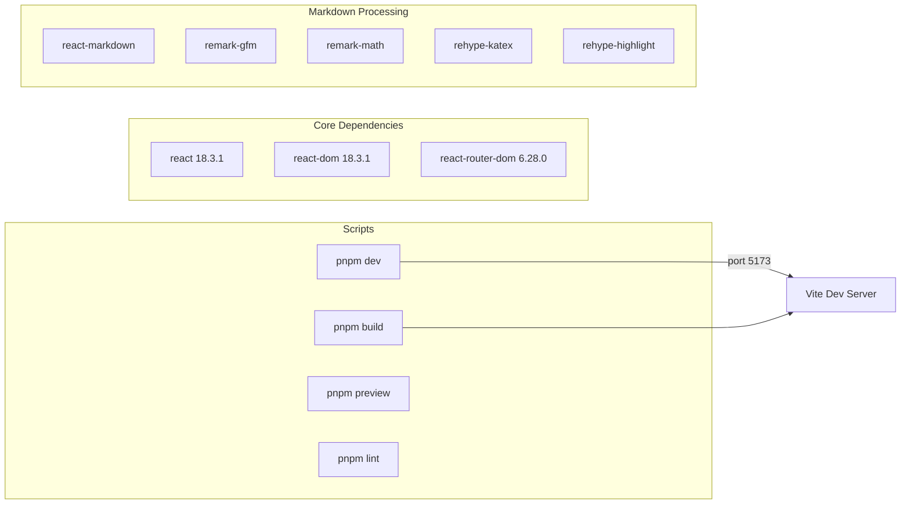

**Key scripts:**
- `pnpm dev` - Starts development server on port 5173
- `pnpm build` - Creates production build in `/dist`
- `pnpm preview` - Preview production build locally

### Build Configuration

| File | Purpose | Key Settings |
|------|---------|--------------|
| `vite.config.js` | Vite build tool configuration | React plugin, dev server port (5173), host binding |
| `postcss.config.js` | CSS processing (if present) | Tailwind CSS, autoprefixer |
| `tailwind.config.js` | Tailwind CSS customization (if present) | Theme, colors, breakpoints |

#### vite.config.js Structure

```javascript
// Simplified view of configuration
export default defineConfig({
  plugins: [react()],      // Enable React JSX
  server: {
    port: 5173,            // Dev server port
    host: true             // Allow external access
  }
})
```

### Environment & Git

| File | Purpose | Contents |
|------|---------|----------|
| `.env` | Environment variables | `ANTHROPIC_API_KEY` (required) |
| `.gitignore` | Git ignore patterns | node_modules, .env, database files, session files |

**Required environment variables:**

| Variable | Location | Purpose |
|----------|----------|---------|
| `ANTHROPIC_API_KEY` | `/server/.env` | Claude API authentication |
| `PORT` | `/server/.env` | Server port (default: 3001) |

### Claude Code Configuration

| File | Purpose |
|------|---------|
| `.claude_settings.json` | Claude Code tool permissions |
| `.claude/settings.local.json` | Local Claude Code overrides |

---

## Frontend Files (`/src`)

The frontend is a React single-page application built with Vite.

### File Overview

| File | Lines | Purpose |
|------|-------|---------|
| `main.jsx` | ~14 | Application entry point, React DOM mounting |
| `App.jsx` | ~9,600 | **Main application** - contains all UI components and logic |
| `ErrorBoundary.jsx` | ~54 | Catches React errors, displays friendly error UI |
| `index.css` | ~69 | Global CSS reset, fonts, accessibility styles |

### main.jsx - Entry Point

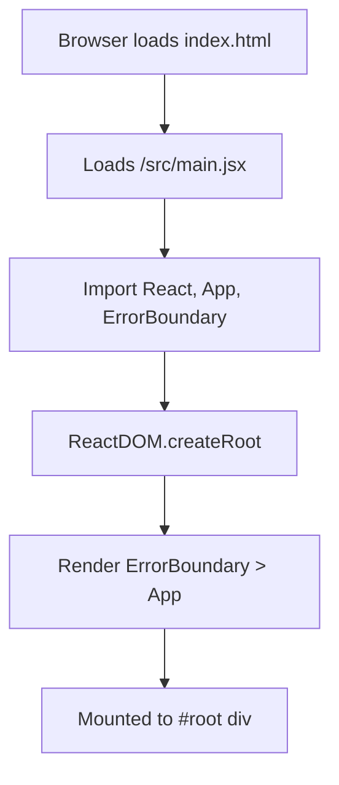

**What it does:**
1. Imports React and ReactDOM
2. Wraps the App in an ErrorBoundary for graceful error handling
3. Mounts the application to the `#root` element in index.html

### App.jsx - The Main Application

This single file contains the entire React frontend. Understanding its structure is essential.

#### Internal Component Map

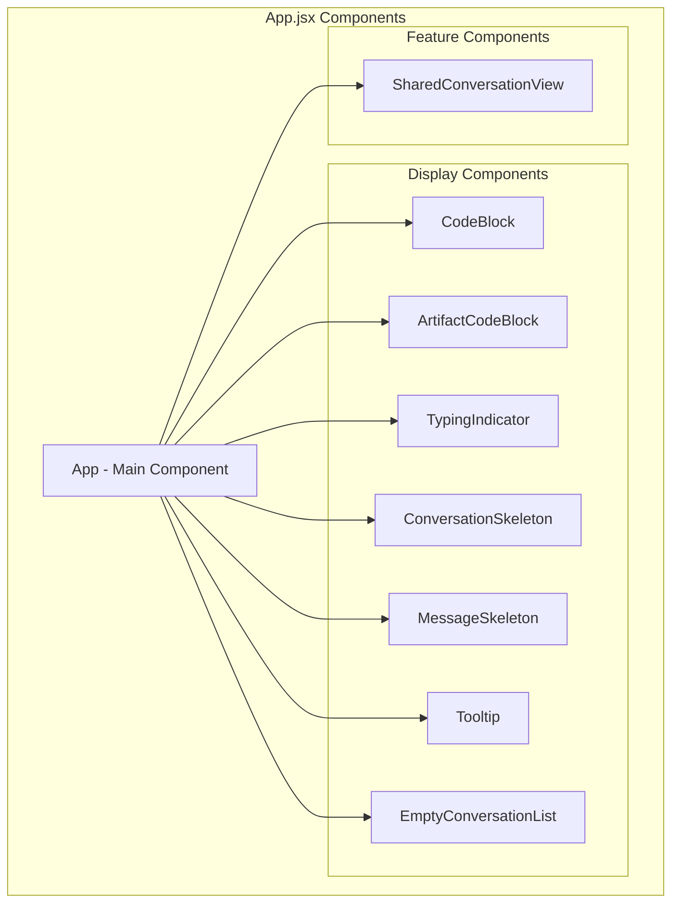

#### App.jsx Sections Reference

| Section (approx. lines) | Contents | Purpose |
|------------------------|----------|---------|
| 1-100 | Imports, API_URL constant | Dependencies and configuration |
| 100-200 | Helper components (CodeBlock, TypingIndicator) | Reusable UI pieces |
| 200-400 | State declarations (`useState`, `useRef`) | Application state management |
| 400-800 | Effect hooks (`useEffect`) | Data fetching, subscriptions |
| 800-1500 | Event handlers | User interaction logic |
| 1500-2500 | API call functions | Backend communication |
| 2500-9600 | JSX render | UI structure and layout |

#### Key State Variables

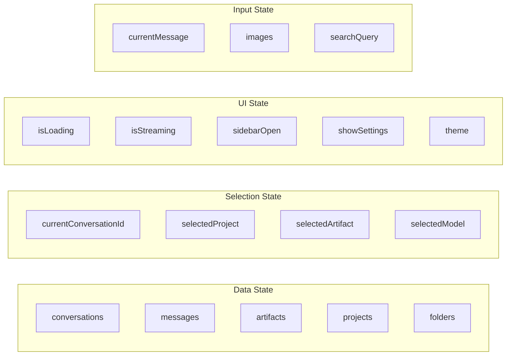

### ErrorBoundary.jsx - Error Handling

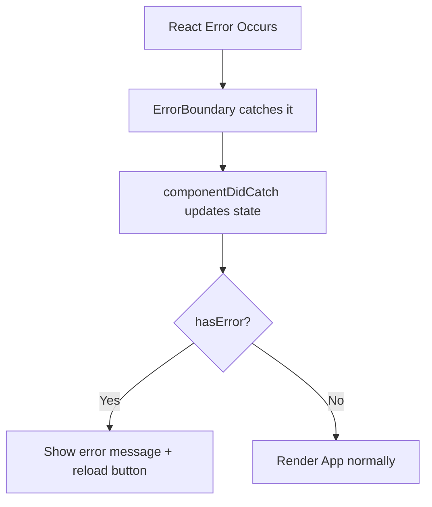

**What it does:**
- Catches JavaScript errors in child components
- Prevents entire app from crashing
- Shows user-friendly error message with details
- Provides reload button to recover

### index.css - Global Styles

| Style Section | Purpose |
|---------------|---------|
| Font import | Google Fonts (Inter family) |
| CSS reset | Consistent base styles across browsers |
| Scrollbar styling | Custom scrollbar appearance |
| Focus indicators | Accessibility - visible focus rings |
| Reduced motion | Respects user's motion preferences |

---

## Backend Files (`/server`)

The backend is an Express.js server providing REST API and Server-Sent Events for streaming.

### File Overview

| File | Lines | Purpose |
|------|-------|---------|
| `server.js` | ~3,470 | **Main server** - Express app, all API routes, database |
| `package.json` | ~30 | Server dependencies |
| `data/claude.db` | Binary | SQLite database file |

### server.js - The API Server

#### Server Architecture

```mermaid
graph TB
    subgraph "Initialization"
        Env[Load .env]
        Express[Create Express app]
        Middleware[Setup middleware]
    end

    subgraph "Database"
        SQLjs[Initialize sql.js]
        Schema[Create/load schema]
        Helpers[Database helpers]
    end

    subgraph "Services"
        Anthropic[Anthropic SDK]
        ArtifactDetect[Artifact detection]
        TitleGen[Title generation]
    end

    subgraph "Routes"
        Auth[/api/auth/*]
        Conv[/api/conversations/*]
        Msg[/api/messages/*]
        Art[/api/artifacts/*]
        Proj[/api/projects/*]
        Share[/api/share/*]
        Settings[/api/settings/*]
    end

    Env --> Express --> Middleware --> SQLjs
    SQLjs --> Schema --> Helpers
    Helpers --> Routes
    Routes --> Services
```

#### server.js Sections Reference

| Section (approx. lines) | Contents | Purpose |
|------------------------|----------|---------|
| 1-50 | Imports, Express setup | Server initialization |
| 50-150 | sql.js initialization | Database setup |
| 150-320 | CREATE TABLE statements | Database schema |
| 320-450 | Helper functions | Utilities (title generation, artifact detection) |
| 450-3470 | Route handlers | All API endpoints |

#### Database Tables Overview

> For complete schema diagrams, see [architecture.md](./architecture.md#4-data-model)

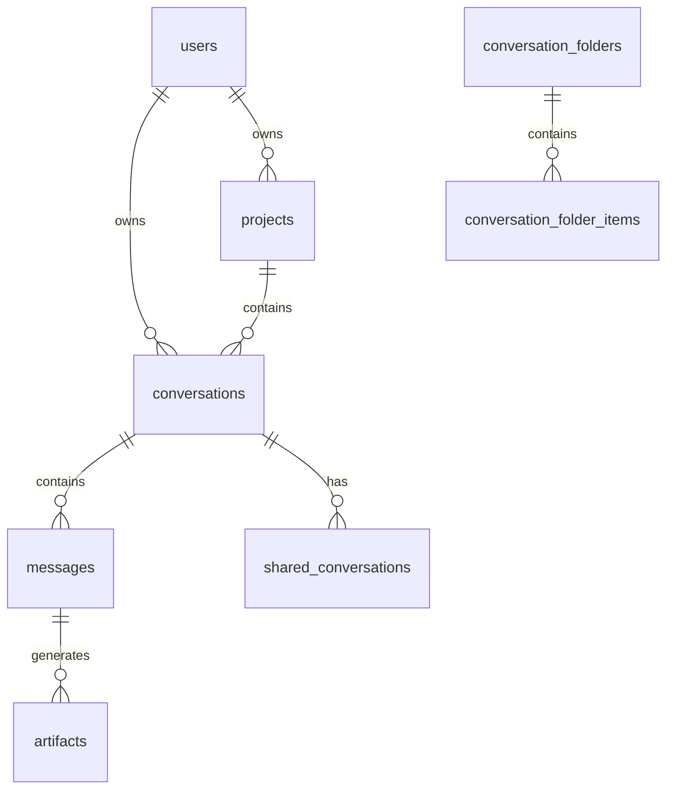

#### API Endpoint Categories

| Category | Base Path | Key Operations |
|----------|-----------|----------------|
| Authentication | `/api/auth` | Get user, update profile |
| Conversations | `/api/conversations` | CRUD, messages, export, archive |
| Messages | `/api/messages` | Edit, delete, regenerate |
| Artifacts | `/api/artifacts` | View, edit, versions |
| Projects | `/api/projects` | CRUD, conversations, analytics |
| Folders | `/api/folders` | CRUD, add/remove items |
| Sharing | `/api/share` | Create, view, revoke |
| Search | `/api/search` | Search across content |
| Settings | `/api/settings` | User preferences |
| Usage | `/api/usage` | Token tracking, costs |

---

## Public Assets (`/public`)

Static files served directly by the web server.

### File Overview

| File | Purpose |
|------|---------|
| `manifest.json` | PWA configuration - app name, icons, theme |
| `service-worker.js` | Offline support, caching strategies |
| `icon.svg` | Main application icon |
| `icon-192.svg` | PWA icon (192x192) |
| `icon-512.svg` | PWA icon (512x512) |
| `icon-maskable.svg` | Adaptive icon for various device shapes |

### PWA Architecture

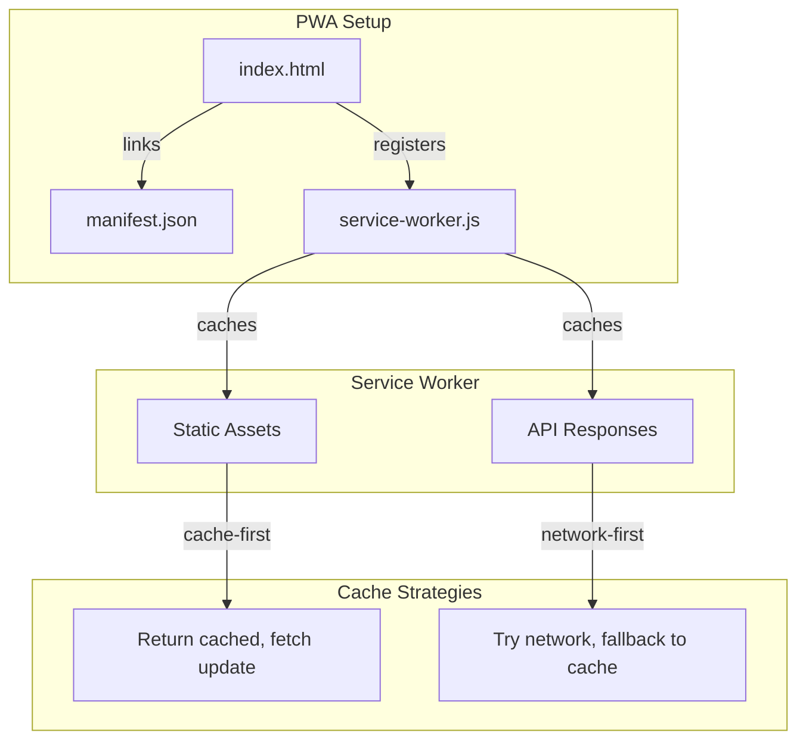

### service-worker.js Caching

| Cache Strategy | Used For | Behavior |
|----------------|----------|----------|
| Cache-first | Static assets (JS, CSS, icons) | Return cached version immediately, update in background |
| Network-first | API calls | Try network, fall back to cache if offline |

---

## HTML Entry Point (`index.html`)

The main HTML file that loads everything.

### Structure Overview

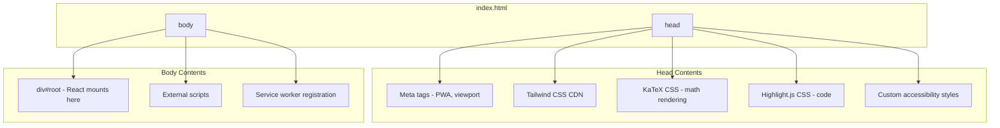

### External Dependencies (CDN)

| Library | Purpose | Loaded In |
|---------|---------|-----------|
| Tailwind CSS | Utility-first styling | `<link>` in head |
| KaTeX | LaTeX math rendering | `<link>` + `<script>` |
| Highlight.js | Code syntax highlighting | `<link>` + `<script>` |
| Mermaid | Diagram rendering | `<script>` |

---

## Documentation (`/docs`)

| File | Purpose |
|------|---------|
| `architecture.md` | Comprehensive system architecture, database schema, API docs |
| `project-files-reference.md` | This file - complete file reference |

---

## File Relationships

### How Files Connect

```mermaid
graph TB
    subgraph "Build Time"
        PKG[package.json] -->|defines| Scripts[npm scripts]
        Vite[vite.config.js] -->|configures| Build[Vite bundler]
        Scripts --> Build
    end

    subgraph "Runtime - Frontend"
        HTML[index.html] -->|loads| Main[main.jsx]
        Main -->|renders| App[App.jsx]
        App -->|imports| CSS[index.css]
        App -->|wrapped by| EB[ErrorBoundary.jsx]
    end

    subgraph "Runtime - Backend"
        Server[server.js] -->|reads| Env[.env]
        Server -->|uses| DB[(claude.db)]
        Server -->|calls| Claude[Claude API]
    end

    subgraph "Communication"
        App <-->|HTTP REST| Server
        App <--|SSE Stream| Server
    end
```

### Data Flow: Sending a Message

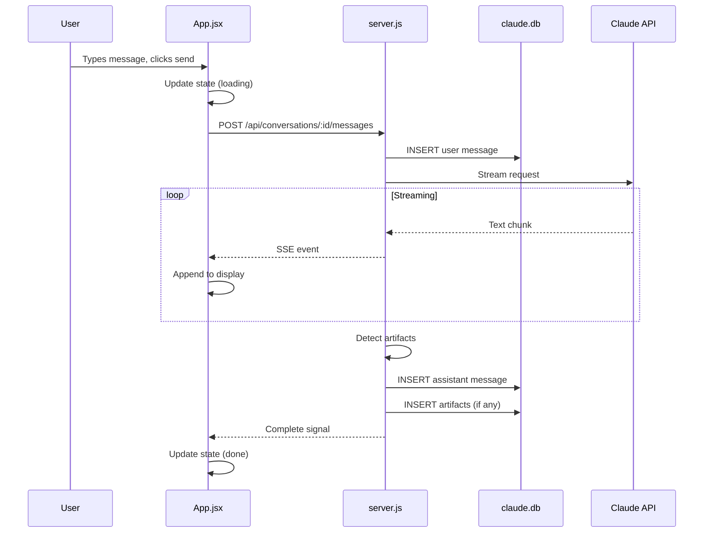

### Data Flow: Loading a Conversation

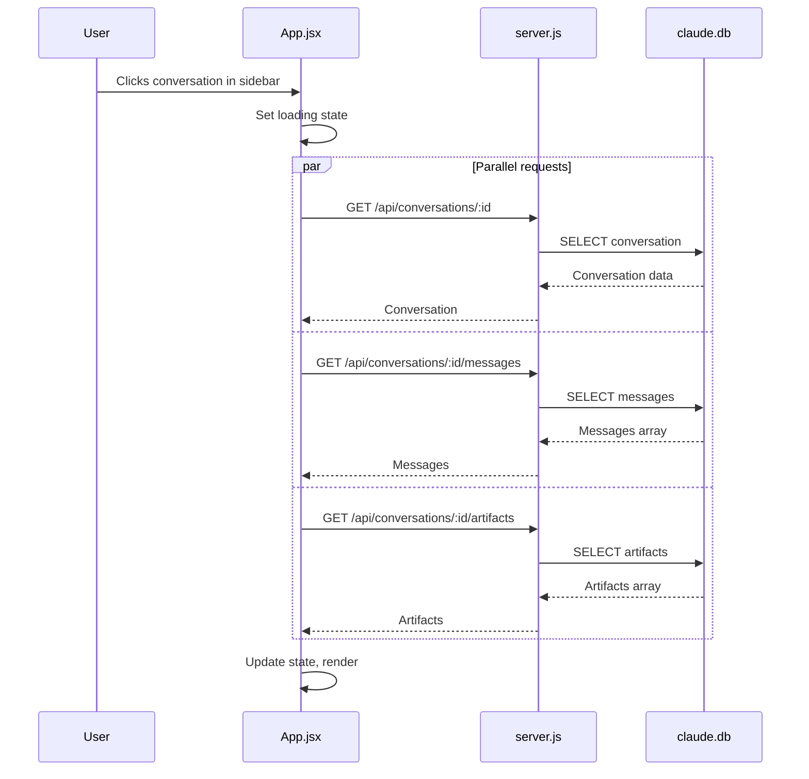

---

## Common Tasks Guide

Quick reference for where to make changes for common development tasks.

### Adding a New Feature

| Task | Files to Modify |
|------|-----------------|
| Add new UI component | `src/App.jsx` (add component, update render) |
| Add new API endpoint | `server/server.js` (add route handler) |
| Add new database table | `server/server.js` (add CREATE TABLE in schema section) |
| Add new state | `src/App.jsx` (add useState declaration) |

### Modifying Existing Features

| Task | Primary File | Section |
|------|--------------|---------|
| Change chat behavior | `src/App.jsx` | Message handling functions |
| Modify API response | `server/server.js` | Route handlers (~450-3470) |
| Update database schema | `server/server.js` | Schema section (~150-320) |
| Change styling | `index.html` (Tailwind classes) or `src/index.css` |
| Modify artifact detection | `server/server.js` | Helper functions (~320-450) |

### Debugging

| Issue | Where to Look |
|-------|---------------|
| UI not updating | `src/App.jsx` - state management, useEffect hooks |
| API errors | `server/server.js` - route handlers, error responses |
| Database issues | `server/server.js` - SQL queries, database helpers |
| Streaming not working | `server/server.js` - SSE implementation, Anthropic SDK calls |
| Styles not applying | `index.html` - Tailwind classes, CDN links |

### File Quick Reference by Feature

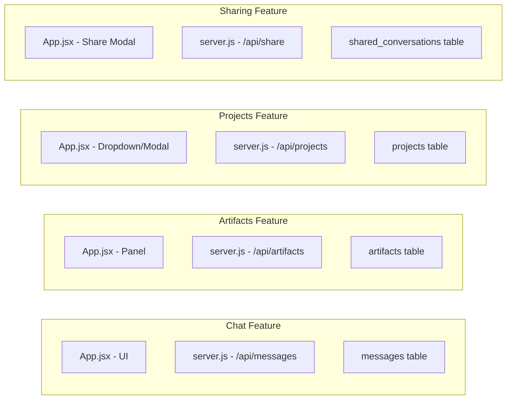

---

## Technology Quick Reference

### Frontend Stack

| Technology | Version | What It Does |
|------------|---------|--------------|
| React | 18.3.1 | Component-based UI framework |
| Vite | 6.0.1 | Fast build tool and dev server |
| React Router | 6.28.0 | Client-side routing |
| Tailwind CSS | 3.4.15 | Utility-first CSS framework |
| react-markdown | 9.0.1 | Renders markdown as React components |
| highlight.js | 11.10.0 | Code syntax highlighting |
| KaTeX | (CDN) | LaTeX math rendering |
| Mermaid | (CDN) | Diagram rendering |

### Backend Stack

| Technology | Version | What It Does |
|------------|---------|--------------|
| Node.js | Latest | JavaScript runtime |
| Express | 4.21.2 | Web server framework |
| sql.js | 1.10.3 | SQLite in JavaScript (WebAssembly) |
| @anthropic-ai/sdk | 0.27.0 | Claude API client |
| cors | 2.8.5 | Cross-origin request handling |
| dotenv | 16.4.7 | Environment variable loading |

### Communication Patterns

| Pattern | Used For | Implementation |
|---------|----------|----------------|
| REST API | CRUD operations | fetch() → Express routes |
| Server-Sent Events | Message streaming | EventSource → Express SSE |
| JSON | Data format | All request/response bodies |

---

## Getting Started Paths

### "I want to understand how the app works"

1. Start with `index.html` - see what loads
2. Read `src/main.jsx` - understand bootstrap
3. Skim `src/App.jsx` - note component structure
4. Check `server/server.js` - understand API structure

### "I want to add a new feature"

1. Define the UI in `src/App.jsx`
2. Add state with `useState`
3. Create API endpoint in `server/server.js`
4. Add database table if needed (in server.js schema section)
5. Connect UI to API with fetch calls

### "I want to fix a bug"

1. Identify if it's frontend (React) or backend (Express)
2. Frontend bugs: Check `src/App.jsx` state and render logic
3. Backend bugs: Check `server/server.js` route handlers
4. Database bugs: Check SQL queries in server.js

### "I want to change the styling"

1. Most styles are Tailwind classes in JSX (App.jsx)
2. Global styles in `src/index.css`
3. Some styles inline in `index.html` head

---

## Summary

This project follows a simple but effective architecture:

- **Two main files** contain most of the logic (App.jsx + server.js)
- **Clear separation** between frontend (React) and backend (Express)
- **SQLite database** for persistence with sql.js
- **Server-Sent Events** for real-time streaming
- **PWA support** for offline functionality

For deeper technical details on any specific area, refer to [architecture.md](./architecture.md).
